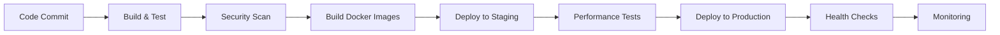

# 🚀 Guia de Deploy e Operações - AIECommerce Platform

Este documento descreve o processo completo de deploy e operações para a plataforma AIECommerce em ambiente de produção.

## 📋 Índice

1. [Pré-requisitos](#pré-requisitos)
2. [Arquitetura de Produção](#arquitetura-de-produção)
3. [Pipeline CI/CD](#pipeline-cicd)
4. [Deploy em Produção](#deploy-em-produção)
5. [Monitoramento e Observabilidade](#monitoramento-e-observabilidade)
6. [Operações e Manutenção](#operações-e-manutenção)
7. [Troubleshooting](#troubleshooting)
8. [Segurança](#segurança)

## 🔧 Pré-requisitos

### Infraestrutura

- **Kubernetes Cluster**: v1.25+ com pelo menos 3 nós worker
- **Storage**: StorageClass com suporte a SSD para alta performance
- **Load Balancer**: Ingress Controller (NGINX) com suporte a SSL
- **Registry**: Container Registry (GitHub Container Registry, Azure Container Registry, etc.)

### Ferramentas

- **kubectl**: v1.25+ configurado para o cluster
- **Helm**: v3.8+ para gerenciamento de pacotes
- **Docker**: Para build local (opcional)
- **PowerShell**: Para scripts de deploy (Windows)

### Recursos Mínimos

```yaml
# Por nó worker
CPU: 8 cores
RAM: 32 GB
Storage: 100 GB SSD

# Cluster total
CPU: 24 cores
RAM: 96 GB
Storage: 300 GB SSD
```

## 🏗️ Arquitetura de Produção

### Topologia de Rede

```
Internet
    ↓
Load Balancer (NGINX Ingress)
    ↓
API Gateway (3+ replicas)
    ↓
ML Services (2+ replicas cada)
    ↓
Database Layer (PostgreSQL + Redis + RabbitMQ)
```

### Componentes Principais

| Componente | Replicas | CPU | RAM | Storage |
|------------|----------|-----|-----|---------|
| API Gateway | 3-10 | 500m-2 | 1Gi-4Gi | 10Gi |
| ML Recommendation | 2-5 | 500m-2 | 1Gi-4Gi | 5Gi |
| PostgreSQL | 3 | 1-4 | 2Gi-8Gi | 100Gi |
| Redis | 3 | 500m-1 | 1Gi-2Gi | 20Gi |
| RabbitMQ | 3 | 500m-1 | 1Gi-2Gi | 10Gi |

## 🔄 Pipeline CI/CD

### Fluxo de Deploy



### GitHub Actions Workflow

O pipeline está configurado em `.github/workflows/ci-cd-pipeline.yml` e inclui:

- **Code Quality**: Análise SonarCloud
- **Security**: Scan com Snyk
- **Build**: Compilação .NET e Docker
- **Testing**: Unit, Integration e Performance
- **Deploy**: Staging e Produção
- **Monitoring**: Health checks e métricas

### Secrets Necessários

⚠️ **Consulte a documentação completa**: [GitHub Secrets Configuration](GITHUB_SECRETS.md)

```bash
# GitHub Secrets
SONAR_TOKEN=your_sonar_token
SONAR_PROJECT_KEY=your_project_key
SONAR_ORGANIZATION=your_org
SNYK_TOKEN=your_snyk_token

# Kubernetes Configs
KUBE_CONFIG_STAGING=base64_encoded_kubeconfig
KUBE_CONFIG_PRODUCTION=base64_encoded_kubeconfig
```

## 🚀 Deploy em Produção

### 1. Deploy Automatizado

```powershell
# Deploy para staging
.\scripts\deploy-production.ps1 -Environment "staging" -Version "v1.2.0"

# Deploy para produção
.\scripts\deploy-production.ps1 -Environment "prod" -Version "v1.2.0"
```

### 2. Deploy Manual

```bash
# Aplicar namespace
kubectl apply -f k8s/namespace.yaml

# Aplicar configurações de produção
kubectl apply -f k8s/production-deployment.yaml
kubectl apply -f k8s/production-ingress.yaml

# Verificar status
kubectl get pods -n aiecommerce
kubectl get services -n aiecommerce
kubectl get ingress -n aiecommerce
```

### 3. Verificação de Deploy

```bash
# Status dos deployments
kubectl rollout status deployment/gateway-production -n aiecommerce
kubectl rollout status deployment/ml-recommendation-production -n aiecommerce

# Logs dos serviços
kubectl logs -f deployment/gateway-production -n aiecommerce
kubectl logs -f deployment/ml-recommendation-production -n aiecommerce

# Health checks
curl -f https://api.aiecommerce.com/health
curl -f https://api.aiecommerce.com/health/ready
curl -f https://api.aiecommerce.com/health/live
```

## 📊 Monitoramento e Observabilidade

### Métricas do Sistema

- **Infraestrutura**: CPU, RAM, Storage, Network
- **Aplicação**: Request rate, Response time, Error rate
- **Business**: User engagement, ML model performance
- **Custom**: API usage, ML inference latency

### Dashboards Grafana

1. **System Overview**: Métricas de infraestrutura
2. **Application Performance**: Latência e throughput
3. **ML Services**: Model performance e accuracy
4. **Business Metrics**: KPIs de negócio

### Alertas

```yaml
# Exemplo de regra de alerta
groups:
  - name: aiecommerce-alerts
    rules:
      - alert: HighErrorRate
        expr: rate(http_requests_total{status=~"5.."}[5m]) > 0.1
        for: 2m
        labels:
          severity: warning
        annotations:
          summary: "High error rate detected"
          description: "Error rate is {{ $value }} errors per second"
```

### Logs

- **Centralização**: ELK Stack (Elasticsearch, Logstash, Kibana)
- **Retenção**: 30 dias para logs de aplicação, 90 dias para auditoria
- **Indexação**: Por serviço, nível de log e timestamp

## 🛠️ Operações e Manutenção

### Scaling

```bash
# Auto-scaling baseado em CPU/Memory
kubectl get hpa -n aiecommerce

# Scaling manual
kubectl scale deployment gateway-production --replicas=5 -n aiecommerce
```

### Updates

```bash
# Rolling update
kubectl set image deployment/gateway-production gateway=ghcr.io/aiecommerce/platform/gateway:v1.2.1 -n aiecommerce

# Rollback
kubectl rollout undo deployment/gateway-production -n aiecommerce
```

### Backup e Recovery

```bash
# Backup do banco
kubectl exec -n aiecommerce deployment/postgres -- pg_dump -U postgres aiecommerce > backup.sql

# Backup das configurações
kubectl get all -n aiecommerce -o yaml > backup.yaml
```

### Maintenance Windows

- **Planned**: Domingos 02:00-06:00 UTC
- **Emergency**: 24/7 com notificação imediata
- **Communication**: Slack, Email, PagerDuty

## 🔍 Troubleshooting

### Problemas Comuns

#### 1. Pods não iniciam

```bash
# Verificar eventos
kubectl describe pod <pod-name> -n aiecommerce

# Verificar logs
kubectl logs <pod-name> -n aiecommerce

# Verificar recursos
kubectl top pods -n aiecommerce
```

#### 2. Serviços não respondem

```bash
# Verificar endpoints
kubectl get endpoints -n aiecommerce

# Testar conectividade
kubectl run test-pod --image=busybox --rm -it --restart=Never -- nslookup gateway-service
```

#### 3. Performance degradada

```bash
# Verificar métricas
kubectl top nodes
kubectl top pods -n aiecommerce

# Verificar logs de performance
kubectl logs -f deployment/gateway-production -n aiecommerce | grep -i performance
```

### Comandos Úteis

```bash
# Debugging
kubectl exec -it <pod-name> -n aiecommerce -- /bin/bash
kubectl port-forward service/gateway-service 8080:80 -n aiecommerce

# Logs
kubectl logs -f -l app=gateway -n aiecommerce
kubectl logs --since=1h -l app=gateway -n aiecommerce

# Status
kubectl get events -n aiecommerce --sort-by='.lastTimestamp'
kubectl describe deployment gateway-production -n aiecommerce
```

## 🔒 Segurança

### Network Policies

```yaml
apiVersion: networking.k8s.io/v1
kind: NetworkPolicy
metadata:
  name: default-deny-all
  namespace: aiecommerce
spec:
  podSelector: {}
  policyTypes:
  - Ingress
  - Egress
```

### RBAC

```yaml
apiVersion: rbac.authorization.k8s.io/v1
kind: Role
metadata:
  namespace: aiecommerce
  name: pod-reader
rules:
- apiGroups: [""]
  resources: ["pods"]
  verbs: ["get", "watch", "list"]
```

### Secrets Management

- **External Secrets Operator**: Para sincronização com Azure Key Vault/AWS Secrets Manager
- **Sealed Secrets**: Para criptografia de secrets no Git
- **Vault**: Para gerenciamento centralizado de secrets

### Compliance

- **SOC 2 Type II**: Auditoria anual
- **GDPR**: Conformidade com regulamentações de dados
- **PCI DSS**: Para processamento de pagamentos
- **ISO 27001**: Gestão de segurança da informação

## 📈 Performance e Otimização

### Tuning de Performance

```yaml
# Gateway Service
resources:
  requests:
    cpu: "500m"
    memory: "1Gi"
  limits:
    cpu: "2"
    memory: "4Gi"
env:
  - name: DOTNET_GCHeapHardLimit
    value: "0x40000000"
  - name: DOTNET_GCAllowVeryLargeObjects
    value: "1"
```

### Caching Strategy

- **Redis**: Cache distribuído para sessões e dados frequentes
- **In-Memory**: Cache local para dados estáticos
- **CDN**: Para assets estáticos e ML models

### Database Optimization

- **Connection Pooling**: MinPoolSize=10, MaxPoolSize=100
- **Indexing**: Índices compostos para queries ML
- **Partitioning**: TimescaleDB para dados temporais

## 🚨 Incident Response

### Escalação

1. **Level 1**: DevOps Engineer (15 min)
2. **Level 2**: Senior DevOps Engineer (30 min)
3. **Level 3**: DevOps Lead + Engineering Manager (1h)
4. **Level 4**: CTO + Emergency Response Team (2h)

### Runbooks

- [Database Recovery](runbooks/database-recovery.md)
- [Service Outage](runbooks/service-outage.md)
- [Security Incident](runbooks/security-incident.md)
- [Performance Degradation](runbooks/performance-degradation.md)

### Post-Incident

- **Post-Mortem**: Documentação detalhada em 48h
- **Action Items**: Implementação de melhorias em 2 semanas
- **Review**: Análise mensal de tendências

## 📞 Suporte e Contato

### Equipe de Operações

- **DevOps Lead**: devops@aiecommerce.com
- **On-Call**: +1-555-0123 (24/7)
- **Emergency**: emergency@aiecommerce.com

### Documentação

- **Runbooks**: `/docs/runbooks/`
- **Architecture**: `/docs/architecture/`
- **API Reference**: `/docs/api/`
- **Troubleshooting**: `/docs/troubleshooting/`

### Comunicação

- **Slack**: #devops-alerts, #incidents
- **Email**: alerts@aiecommerce.com
- **PagerDuty**: Escalação automática
- **Status Page**: https://status.aiecommerce.com

---

**Última atualização**: $(Get-Date -Format "yyyy-MM-dd")
**Versão**: 1.0.0
**Responsável**: DevOps Team
